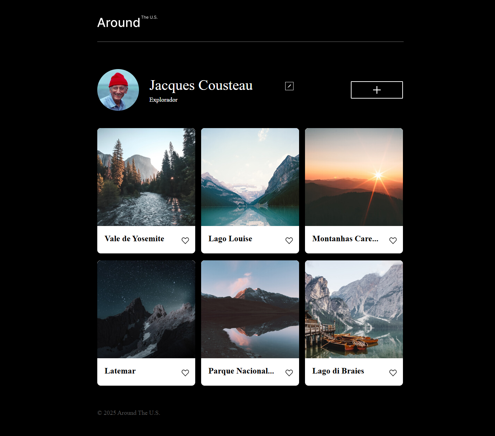

# 🌐 Tripleten web_project_around



> Click on the image above to access the project in production:

> 👉 [https://perozin.github.io/web_project_around/src](https://perozin.github.io/web_project_around/src)

---

## 📋 Description

This project was developed as part of the **Full-Stack Web Developer** training at the **TripleTen** bootcamp. It's a **responsive landing page**, focused on applying the fundamentals of HTML, CSS and responsive design and applying the fundamentals of JavaScript and DOM (Document Object Model), with special attention to code organization according to the **BEM Methodology**.

---

## 🚀 Technologies and Tools Used

- 🎨 HTML5
- 💠 CSS3
- ⚙️ JavaScript (ES6+) — comportamento, interatividade e lógica no cliente.
- 🏗️ DOM (Document Object Model) — manipulação da estrutura e conteúdo da página via JS.
- 🧭 Git + GitHub
- 🌐 GitHub Pages
- 📱 Media Queries (responsividade)
- 🔧 CSS Flexbox e Grid Layout
- 📐 BEM Methodology (Block Element Modifier)
- 🧑‍🎨 Interface design with Figma
- 💻 Responsive web design
- ✅ Basic semantics and clear directory structure

---

## 🖼️ Features

- Adaptable layout for different screen sizes (mobile, tablet, and desktop)
- Clean and modern design based on a Figma prototype
- Code organization with best practices and semantics
- Clear folder and file structure

---

## 🛠️ Mode of Interaction

---

### ✏️ Edit Profile

| Item | Action                 | Observation                                  |
| ---- | ---------------------- | -------------------------------------------- |
| 1    | Hover over the pencil  | Show cursor hovering over the icon           |
| 2    | Click the pencil       | **Edit Profile** pop-up opens                |
| 3    | Enter name + activity  | Enter the new values                         |
| 4    | Click **Save**         | The pop-up closes and the profile is updated |
| 5    | Click the **X** button | To close without saving                      |

---

### 📍 New Location

| Item | Action            | Observation                       |
| ---- | ----------------- | --------------------------------- |
| 1    | Click the **Add** | Opens the **New Location** pop-up |
| 2    | **Title**         | Location name                     |
| 3    | **Link**          | Image URL                         |
| 4    | Click **Create**  | New image appears in the gallery  |
| 🗑️   | **Trash can**     | Delete the image                  |
| ❤️   | **Like button**   | Like/unlike                       |

---

### 🖼️ Image View

| Item | Action             | Observation                     |
| ---- | ------------------ | ------------------------------- |
| 1    | Click on any image | It displays in an enlarged size |
| 2    | Show caption       | Visible image footer            |
| 3    | Close image        | Back to gallery                 |

---

## 📁 Project structure

```
web_project_homeland/
├── .vscode/
│ ├── extensions.json
│ └── settings.json
│
├── blocks/
│ ├── content.css
│ ├── element.css
| ├── elements.css
| ├── footer.css
│ ├── form.css
│ ├── header.css
│ ├── page.css
│ ├── modal.css
│ ├── profile.css
│ └── root.css
│
├── images/
│ └── [imagens do projeto]
│
├── pages/
│ └── index.css
│
├── scripts/
│ └── index.js
│
├── vendor/
│ ├── fonts/
│ │ └── [arquivos de fontes]
│ ├── fonts.css
│ └── normalize.css
│
├── .editorconfig
├── .gitignore
├── .prettierignore
├── favicon.ico
├── index.html
└── README.md
```

---

## 📌 How to view the project

You can directly access the project hosted on GitHub Pages:  
👉 **[perozin.github.io/web_project_around](https://perozin.github.io/web_project_around/src)**

Or clone and run locally:

<pre><code>
  . bash
  . git clone https://github.com/Perozin/web_project_around.git 
  . cd web_project_around
  . Then, open the index.html file in your browser.
</code></pre>

---

## 📚 Lessons learned from the project

```

✅ Page structuring with HTML5
✅ Visual organization with CSS3
✅ Centering with Flexbox
✅ Grid layout with Grid
✅ Responsive design with `@media`
✅ Free publishing with GitHub Pages
✅ Version control with Git
✅ Basic JavaScript and Working with the DOM

```

---

## 🚧 Future improvements (to-do)

- [ ] ✨ Add smooth CSS animations
- [ ] 🧩 Include basic JavaScript interactions
- [ ] 🎞️ Integrate the application with a database server

---

## 📄 License

This project is licensed under the [MIT](https://opensource.org/licenses/MIT).

---

## 🙋‍♂️ Author

**Márcio Perozin**  
🔗 [GitHub](https://github.com/Perozin) • [LinkedIn](https://www.linkedin.com/in/marcio-perozin-58162334)

---
